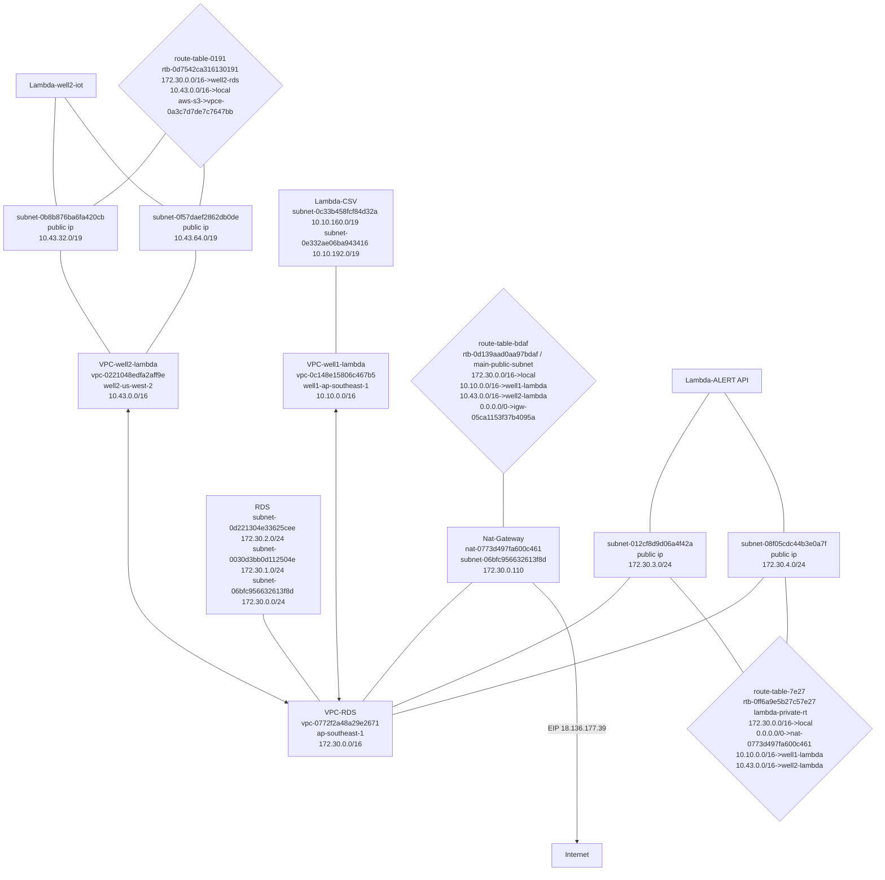
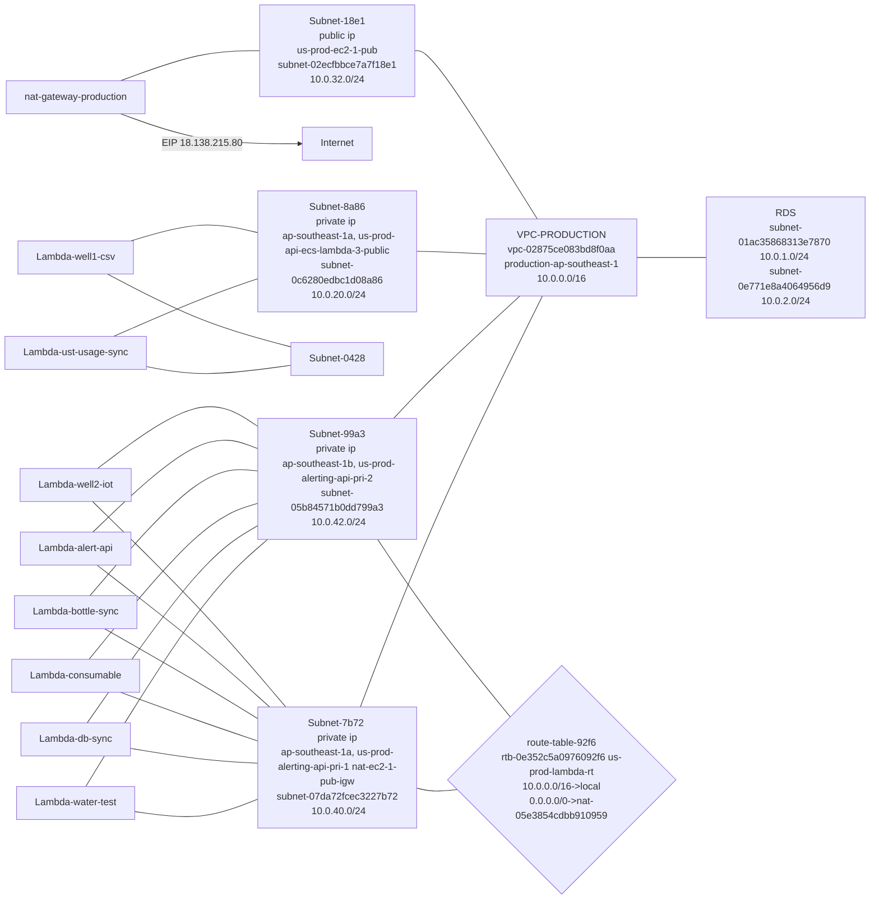

---

Date: 2021-07-05
Topic:
-  Urban Spring
-  VPC survey
Ref:
---

### Testing Env

```mermaid
flowchart TD
    VPC-well2-lambda[VPC-well2-lambda<br/>vpc-0221048edfa2aff9e<br/> well2-us-west-2 <br/> 10.43.0.0/16 ] <---> vpc-rds[VPC-RDS<br/>vpc-0772f2a48a29e2671<br/>  ap-southeast-1 <br/> 172.30.0.0/16]
	
	Subnet-20cb[subnet-0b8b876ba6fa420cb<br/> public ip <br/>10.43.32.0/19]---VPC-well2-lambda
	Subnet-b0de[subnet-0f57daef2862db0de<br/> public ip <br/>10.43.64.0/19]---VPC-well2-lambda
    Lambda-well2-iot ---Subnet-20cb
	Lambda-well2-iot ---Subnet-b0de

	route-table-0191{route-table-0191<br/>rtb-0d7542ca316130191<br/>172.30.0.0/16->well2-rds<br/>10.43.0.0/16->local<br/> aws-s3->vpce-0a3c7d7de7c7647bb}---Subnet-20cb
	route-table-0191---Subnet-b0de

	
VPC-well1-lambda[VPC-well1-lambda<br/>vpc-0c148e15806c467b5<br/> well1-ap-southeast-1 <br/> 10.10.0.0/16 ] <---> vpc-rds
	
    Lambda-well1-csv[Lambda-CSV<br/>subnet-0c33b458fcf84d32a 10.10.160.0/19 <br/>subnet-0e332ae06ba943416 10.10.192.0/19] ---VPC-well1-lambda 
	route-table-bdaf{route-table-bdaf<br/>rtb-0d139aad0aa97bdaf / main-public-subnet<br/>172.30.0.0/16->local<br/>10.10.0.0/16->well1-lambda<br/>10.43.0.0/16->well2-lambda<br/>0.0.0.0/0->igw-05ca1153f37b4095a}---nat-gateway-testing
	
	nat-gateway-testing[Nat-Gateway<br/>nat-0773d497fa600c461<br/>subnet-06bfc956632613f8d<br/>172.30.0.110]---vpc-rds
	nat-gateway-testing--->|EIP 18.136.177.39|Internet

	RDS[RDS <br/> subnet-0d221304e33625cee 172.30.2.0/24 <br/> subnet-0030d3bb0d112504e 172.30.1.0/24 <br/> subnet-06bfc956632613f8d 172.30.0.0/24] --- vpc-rds 
	
	alert-api[Lambda-ALERT API] ---
Subnet-f42a

	alert-api ---
Subnet-0a7f


	Subnet-f42a[subnet-012cf8d9d06a4f42a<br/>public ip<br/> 172.30.3.0/24]---vpc-rds 
	
	Subnet-0a7f[subnet-08f05cdc44b3e0a7f<br/>public ip <br/> 172.30.4.0/24]---vpc-rds 
	
	Subnet-f42a---route-table-7e27{route-table-7e27<br/>rtb-0ff6a9e5b27c57e27<br/> lambda-private-rt<br/> 172.30.0.0/16->local<br/>0.0.0.0/0->nat-0773d497fa600c461<br/>10.10.0.0/16->well1-lambda<br/>10.43.0.0/16->well2-lambda}
	
	Subnet-0a7f---route-table-7e27
```

### Production Env

```mermaid
flowchart LR

	Subnet-18e1[Subnet-18e1 <br/>public ip<br/>us-prod-ec2-1-pub<br/>subnet-02ecfbbce7a7f18e1<br/> 10.0.32.0/24]---us-prod-vpc 
	
	
nat-gateway-production---Subnet-18e1

nat-gateway-production-->|EIP 18.138.215.80|Internet

    us-prod-vpc[VPC-PRODUCTION<br/>vpc-02875ce083bd8f0aa<br/>production-ap-southeast-1<br/>10.0.0.0/16] --- RDS[RDS<br/>subnet-01ac35868313e7870 10.0.1.0/24 <br/>subnet-0e771e8a4064956d9 10.0.2.0/24]
	
	
	Subnet-8a86[Subnet-8a86<br/>private ip <br/> ap-southeast-1a, us-prod-api-ecs-lambda-3-public<br/>subnet-0c6280edbc1d08a86<br/> 10.0.20.0/24]---us-prod-vpc
	
	Lambda-well1-csv---Subnet-0428
	Lambda-well1-csv---Subnet-8a86
	
	
	Lambda-ust-usage-sync---Subnet-0428
	Lambda-ust-usage-sync---Subnet-8a86
	
	Subnet-99a3---route-table-92f6{route-table-92f6<br/>rtb-0e352c5a0976092f6 us-prod-lambda-rt<br/>10.0.0.0/16->local<br/>0.0.0.0/0->nat-05e3854cdbb910959<br/>}
	
	Subnet-99a3[Subnet-99a3<br/>private ip <br/> ap-southeast-1b, us-prod-alerting-api-pri-2<br/>subnet-05b84571b0dd799a3<br/> 10.0.42.0/24]---us-prod-vpc


	Subnet-7b72[Subnet-7b72 <br/>private ip<br/>ap-southeast-1a, us-prod-alerting-api-pri-1 nat-ec2-1-pub-igw<br/>subnet-07da72fcec3227b72<br/> 10.0.40.0/24]---us-prod-vpc 
	Subnet-7b72---route-table-92f6

	Lambda-well2-iot --- Subnet-7b72	
	Lambda-well2-iot --- Subnet-99a3	
	Lambda-alert-api --- Subnet-7b72	
	Lambda-alert-api--- Subnet-99a3		
	Lambda-bottle-sync --- Subnet-99a3
	Lambda-bottle-sync --- Subnet-7b72
	Lambda-consumable --- Subnet-99a3
	Lambda-consumable --- Subnet-7b72	
	Lambda-db-sync --- Subnet-99a3
	Lambda-db-sync--- Subnet-7b72		
	Lambda-water-test --- Subnet-99a3
	Lambda-water-test--- Subnet-7b72		
```

